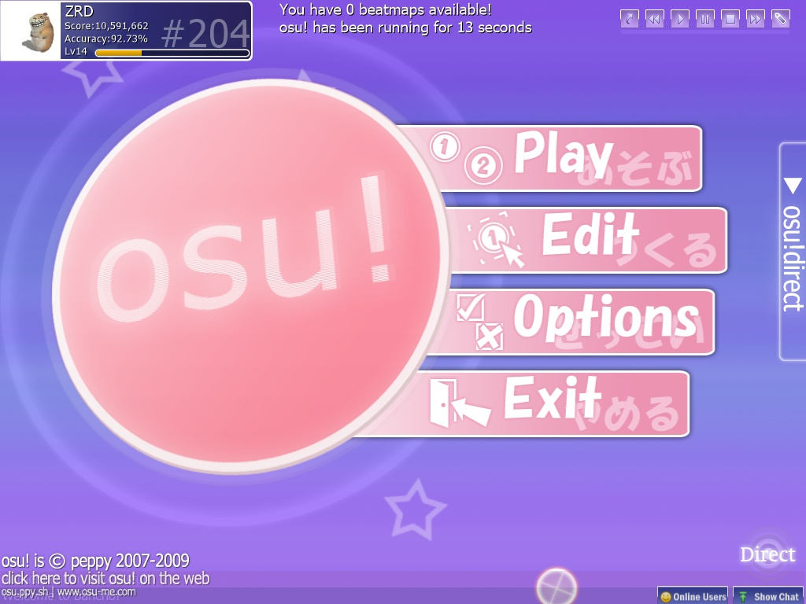

## Clients

**Collection of pre-patched clients for use on `osu.lekuru.xyz` (osu!titanic).**
All clients were taken from [Osekai Snapshots](https://osekai.net/snapshots) and [Discord](https://discord.gg/qupv72e7YH).
> [!NOTE]
> If you want to play a **specific version**, feel free to make an **issue/request** in: 
> - [Github](https://github.com/osuTitanic/clients/issues/new/choose)
> - [Discord](https://discord.gg/qupv72e7YH)

**Instructions** on how to **patch manually** [here](https://github.com/osuTitanic/clients/blob/main/PATCHING.md).

**For any legal issues with this repository, please contact me at Discord or Email: [contact@lekuru.xyz](mailto:contact@lekuru.xyz)!**

## Tested Versions
 - b20141222.6cuttingedge (christmas-themed version)
 - b20141206cuttingedge (with a little easter egg)
 - b20141109.14cuttingedge (cutting edge, has triangles that you can use custom color when you gonna drop png file to osu window)
 - b20140909.11cuttingedge (test version from late 2014, with 2015 UI)
 - b20140909.7cuttingedge (same b20140909.11cuttingedge, without the UI update), **(thanks to [heli](https://osu.lekuru.xyz/u/773) for testing)**
 - b20140616.test (earliest versions to support decimal AR, OD, CS values)
 - b20140323.3 (new settings menu)
 - b20131129.1 (first version with global background dim, hit error bar)
 - b20130606.1 (new UI update and some extra patches for relax)
 - b20130303 (last build before 2013's UI update)
 - b20121223 (version from 2012)
 - b20121003shine.test (early version of osu!mania and the fancy benchmark), **(thanks to [zverhome](https://osu.lekuru.xyz/u/47) for testing)**
 - b20120916 (version from 2012)
 - b20120522 (version from 2012)
 - b1844.test (build to test the osz2 file format)
 - b1821 (last build from 2011)
 - b1704 (no info), **(thanks to [zverhome](https://osu.lekuru.xyz/u/47) for testing)**
 - b1700 (last build from 2010)
 - b1596 (no info, version from 2010), **(thanks to [zverhome](https://osu.lekuru.xyz/u/47) for testing)**
 - b1218 (version from early 2010)
 - b1122 (no info, same b1077a with bugfixes)
 - b1077a (added proper widescreen support)
 - b904 (no info)
 - b833 (a very early (and as expected, buggy) implementation of support widescreen), **(thanks to [zverhome](https://osu.lekuru.xyz/u/47) for testing)**
 - b753c (added local rankings)
 - b699 (no info)
 - b497 (adds a new song select style and the first version of osu!direct)
 - b452 (a very early OpenGL build, that also features work-in-progress sliders)
 - b420 (a build from 2008, the first public build featuring the Auto and SpunOut mods)

## Known bugs:
> [!WARNING]
>  - b20141109.14cuttingedge (cutting edge, version with bugged intro)
>  - b20140909.11cuttingedge (test version, client had a restartloop)
>  - b20140909.7cuttingedge (cutting edge, client had a restartloop, replace the osu!.cfg with [osu!.cfg patched](https://github.com/NamOpt/clients/blob/patch-1/patched%20file/osu!.cfg) to fix)
## Screenshots
#### b20141109.14cuttingedge - 2014 (Old ui but settings have new ui)

#### b20140909.11cuttingedge - 2014 (2015 UI Test)

#### b20130606.1 - 2013 (After UI Update)

#### b20130303 - 2013 (Before UI Update)

#### b20121223 - 2012

#### b20121003shine.test - 2012

#### b20120916 - 2012

#### b20120522 - 2012

#### b1821 - 2011

#### b1704 - 2010

#### b1700 - 2010

#### b1596 - 2010

#### b1218 - 2009/10

#### b1122 - 2009

#### b1077a - 2009

#### b833 - 2009

#### b753c - 2009

#### b699 - 2009

#### b497 - 2008

#### b452 - 2008

#### b420 - 2008

